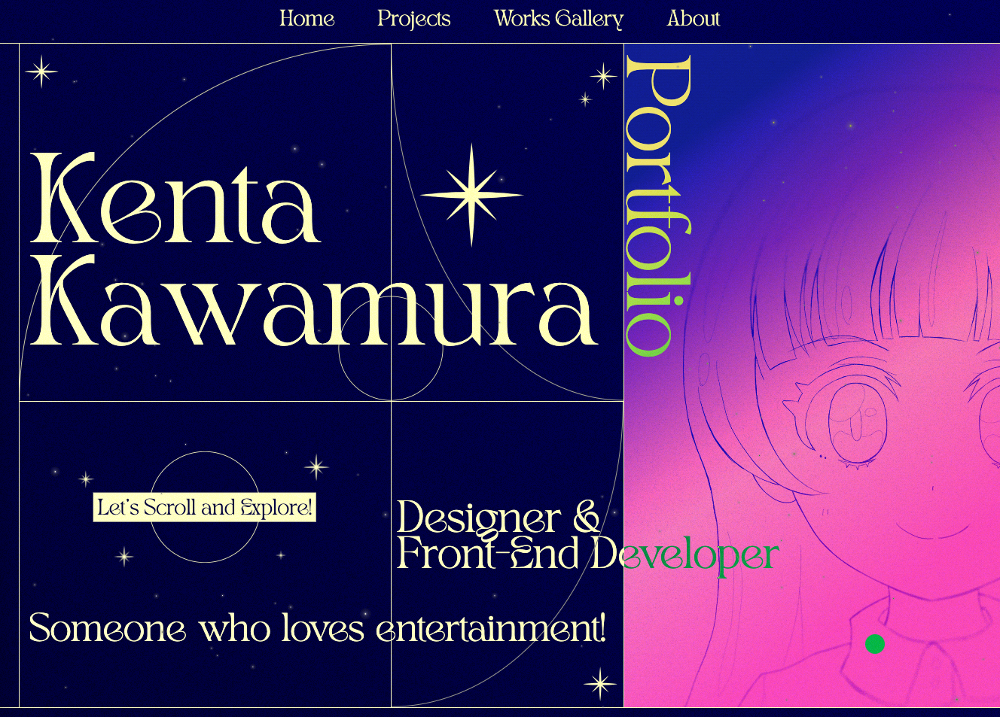

# k-kawamura Portfolio site サンプルコード
※本コードはコードの参考用です。
APIの設定などがされておりませんので開発環境の起動に調整が必要となります。

## DEMO
https://portfolio.kenpachi.design/




## Next.jsで構築
Next.jsのStatic Exportsにて対応しております。

## アニメーション
アニメーションはGSAPとFramer motionにて対応しております。
ページのトランジションアニメーションはGSAPで対応しております。

## 動的ルーティング
works galleryページなどは動的ルーティングで出力しております。
generateStaticParams()にて静的ページを出力します。
### ex.
```
export async function generateStaticParams() {
  const workIds = Object.keys(workList);

  return workIds.map((id) => ({
    slug: id,
  }));
}
```

## 画像最適化
next-image-export-optimizerを使用して
画面幅に最適な画像を出し分けます。
静的エクスポートを前提としていたので、各画面幅ごとの画像を自動的に生成後、
サーバーにアップロードしております。
